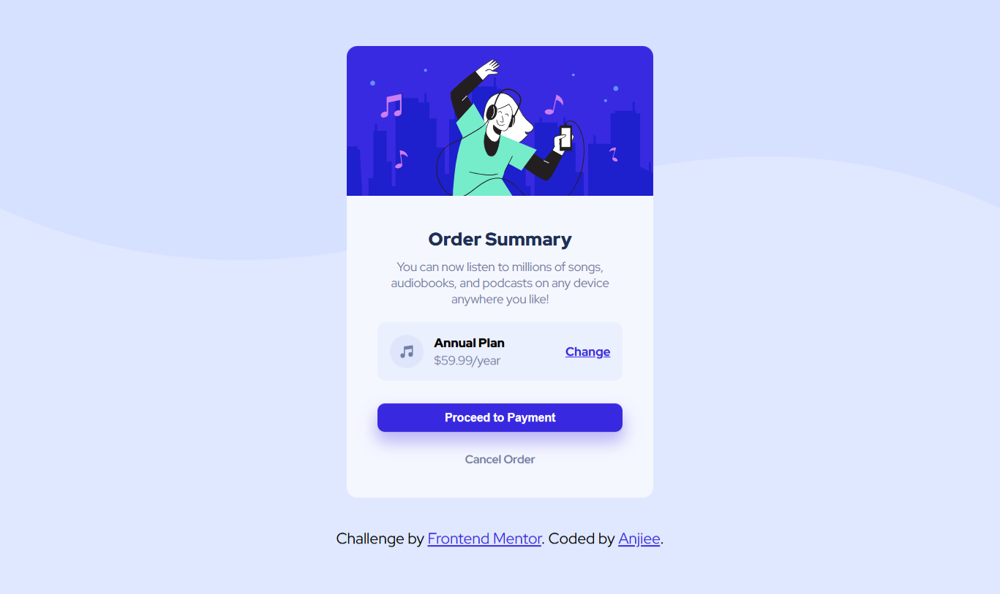

# Frontend Mentor - Order summary card solution

This is a solution to the [Order summary card challenge on Frontend Mentor](https://www.frontendmentor.io/challenges/order-summary-component-QlPmajDUj). Frontend Mentor challenges help you improve your coding skills by building realistic projects. 

## Table of contents

- [Overview](#overview)
  - [The challenge](#the-challenge)
  - [Screenshot](#screenshot)
  - [Links](#links)
- [My process](#my-process)
  - [Built with](#built-with)
  - [What I learned](#what-i-learned)
  - [Continued development](#continued-development)
- [Author](#author)
## Overview

### The challenge

Users should be able to:

- See hover states for interactive elements

### Screenshot

### Links

- Solution URL: [Add solution URL here](https://www.frontendmentor.io/solutions/order-summary-component-zM7Es9ZI2P)
- Live Site URL: [Add live site URL here](https://dreamy-conkies-4d6f08.netlify.app/)

## My process

### Built with

- Semantic HTML5 markup
- CSS custom properties
- Flexbox

### What I learned
I learnt how to use flexbx, displays, position, height and width properties for resposniveness and also the div element for structure and neat styling.

### Continued development
  I want to keep practicing my use of flexbox and the properties that work with it.

## Author
- Frontend Mentor - [@anjola757-coder](https://www.frontendmentor.io/profile/anjola757-coder)

